# Architecture Diagrams - nself-chat v0.3.0

Complete visual documentation of nself-chat's architecture, data flows, and system interactions.

---

## Table of Contents

- [System Architecture](#system-architecture)
- [Database Entity Relationships](#database-entity-relationships)
- [Authentication Flows](#authentication-flows)
- [Message Lifecycle](#message-lifecycle)
- [Search Architecture](#search-architecture)
- [Bot API Flow](#bot-api-flow)
- [Social Media Integration](#social-media-integration)
- [Deployment Architecture](#deployment-architecture)
- [Frontend State Management](#frontend-state-management)

---

## System Architecture

### High-Level System Overview

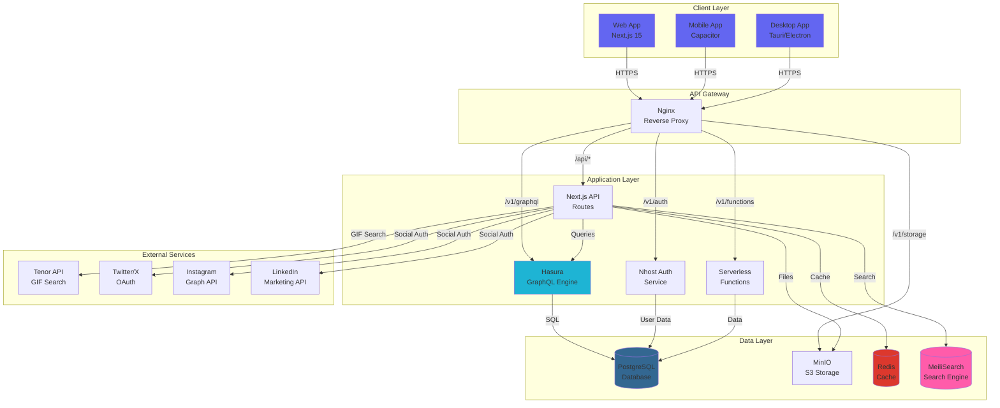
```mermaid
graph TB
    subgraph "Client Layer"
        WEB[Web App<br/>Next.js 15]
        MOBILE[Mobile App<br/>Capacitor]
        DESKTOP[Desktop App<br/>Tauri/Electron]
    end

    subgraph "API Gateway"
        NGINX[Nginx<br/>Reverse Proxy]
    end

    subgraph "Application Layer"
        NEXTAPI[Next.js API<br/>Routes]
        HASURA[Hasura<br/>GraphQL Engine]
        AUTH[Nhost Auth<br/>Service]
        FUNCTIONS[Serverless<br/>Functions]
    end

    subgraph "Data Layer"
        POSTGRES[(PostgreSQL<br/>Database)]
        MINIO[MinIO<br/>S3 Storage]
        REDIS[(Redis<br/>Cache)]
        MEILI[(MeiliSearch<br/>Search Engine)]
    end

    subgraph "External Services"
        TENOR[Tenor API<br/>GIF Search]
        TWITTER[Twitter/X<br/>OAuth]
        INSTAGRAM[Instagram<br/>Graph API]
        LINKEDIN[LinkedIn<br/>Marketing API]
    end

    WEB -->|HTTPS| NGINX
    MOBILE -->|HTTPS| NGINX
    DESKTOP -->|HTTPS| NGINX

    NGINX -->|/api/*| NEXTAPI
    NGINX -->|/v1/graphql| HASURA
    NGINX -->|/v1/auth| AUTH
    NGINX -->|/v1/storage| MINIO
    NGINX -->|/v1/functions| FUNCTIONS

    NEXTAPI -->|Queries| HASURA
    HASURA -->|SQL| POSTGRES
    AUTH -->|User Data| POSTGRES
    FUNCTIONS -->|Data| POSTGRES

    NEXTAPI -->|Cache| REDIS
    NEXTAPI -->|Search| MEILI
    NEXTAPI -->|Files| MINIO

    NEXTAPI -->|GIF Search| TENOR
    NEXTAPI -->|Social Auth| TWITTER
    NEXTAPI -->|Social Auth| INSTAGRAM
    NEXTAPI -->|Social Auth| LINKEDIN

    style WEB fill:#6366f1
    style MOBILE fill:#6366f1
    style DESKTOP fill:#6366f1
    style HASURA fill:#1eb4d4
    style POSTGRES fill:#336791
    style REDIS fill:#dc382d
    style MEILI fill:#ff5caa
```

### Technology Stack

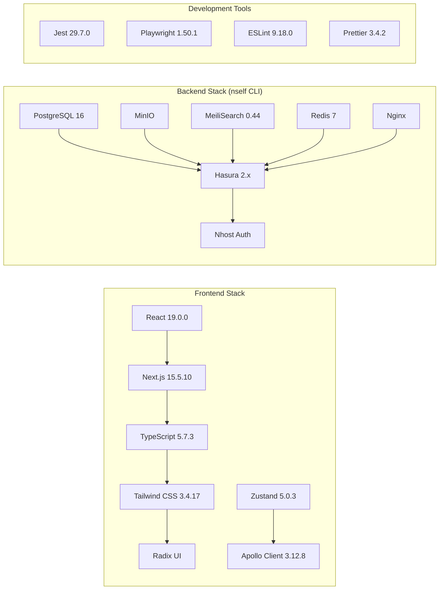
```mermaid
graph LR
    subgraph "Frontend Stack"
        A[React 19.0.0]
        B[Next.js 15.5.10]
        C[TypeScript 5.7.3]
        D[Tailwind CSS 3.4.17]
        E[Radix UI]
        F[Zustand 5.0.3]
        G[Apollo Client 3.12.8]
    end

    subgraph "Backend Stack (nself CLI)"
        H[PostgreSQL 16]
        I[Hasura 2.x]
        J[Nhost Auth]
        K[MinIO]
        L[MeiliSearch 0.44]
        M[Redis 7]
        N[Nginx]
    end

    subgraph "Development Tools"
        O[Jest 29.7.0]
        P[Playwright 1.50.1]
        Q[ESLint 9.18.0]
        R[Prettier 3.4.2]
    end

    A --> B
    B --> C
    C --> D
    D --> E
    F --> G

    H --> I
    I --> J
    K --> I
    L --> I
    M --> I
    N --> I
```

---

## Database Entity Relationships

### Core Entities

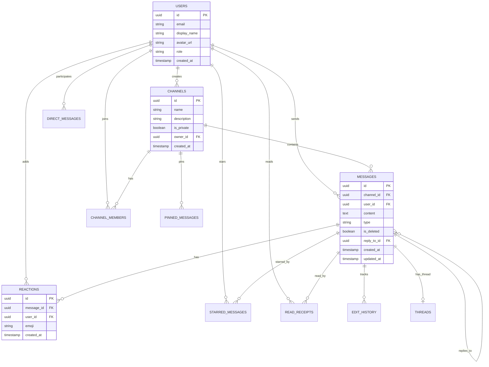
```mermaid
erDiagram
    USERS ||--o{ MESSAGES : sends
    USERS ||--o{ CHANNELS : creates
    USERS ||--o{ CHANNEL_MEMBERS : joins
    USERS ||--o{ DIRECT_MESSAGES : participates
    USERS ||--o{ REACTIONS : adds
    USERS ||--o{ STARRED_MESSAGES : stars
    USERS ||--o{ READ_RECEIPTS : reads

    CHANNELS ||--o{ MESSAGES : contains
    CHANNELS ||--o{ CHANNEL_MEMBERS : has
    CHANNELS ||--o{ PINNED_MESSAGES : pins

    MESSAGES ||--o{ REACTIONS : has
    MESSAGES ||--o{ EDIT_HISTORY : tracks
    MESSAGES ||--o{ STARRED_MESSAGES : starred_by
    MESSAGES ||--o{ READ_RECEIPTS : read_by
    MESSAGES ||--o| THREADS : has_thread
    MESSAGES ||--o{ MESSAGES : replies_to

    USERS {
        uuid id PK
        string email
        string display_name
        string avatar_url
        string role
        timestamp created_at
    }

    CHANNELS {
        uuid id PK
        string name
        string description
        boolean is_private
        uuid owner_id FK
        timestamp created_at
    }

    MESSAGES {
        uuid id PK
        uuid channel_id FK
        uuid user_id FK
        text content
        string type
        boolean is_deleted
        uuid reply_to_id FK
        timestamp created_at
        timestamp updated_at
    }

    REACTIONS {
        uuid id PK
        uuid message_id FK
        uuid user_id FK
        string emoji
        timestamp created_at
    }
```

### Advanced Messaging Entities

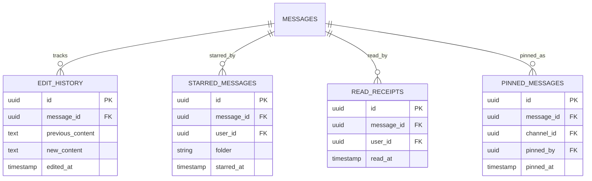
```mermaid
erDiagram
    MESSAGES ||--o{ EDIT_HISTORY : tracks
    MESSAGES ||--o{ STARRED_MESSAGES : starred_by
    MESSAGES ||--o{ READ_RECEIPTS : read_by
    MESSAGES ||--o{ PINNED_MESSAGES : pinned_as

    EDIT_HISTORY {
        uuid id PK
        uuid message_id FK
        text previous_content
        text new_content
        timestamp edited_at
    }

    STARRED_MESSAGES {
        uuid id PK
        uuid message_id FK
        uuid user_id FK
        string folder
        timestamp starred_at
    }

    READ_RECEIPTS {
        uuid id PK
        uuid message_id FK
        uuid user_id FK
        timestamp read_at
    }

    PINNED_MESSAGES {
        uuid id PK
        uuid message_id FK
        uuid channel_id FK
        uuid pinned_by FK
        timestamp pinned_at
    }
```

### Security Entities

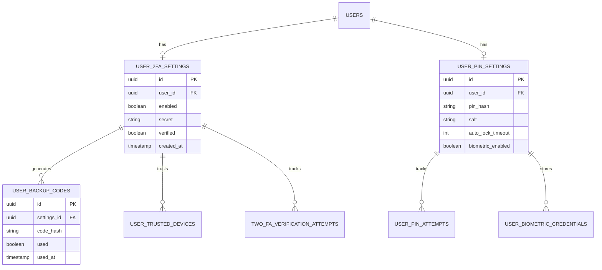
```mermaid
erDiagram
    USERS ||--o| USER_2FA_SETTINGS : has
    USER_2FA_SETTINGS ||--o{ USER_BACKUP_CODES : generates
    USER_2FA_SETTINGS ||--o{ USER_TRUSTED_DEVICES : trusts
    USER_2FA_SETTINGS ||--o{ TWO_FA_VERIFICATION_ATTEMPTS : tracks

    USERS ||--o| USER_PIN_SETTINGS : has
    USER_PIN_SETTINGS ||--o{ USER_PIN_ATTEMPTS : tracks
    USER_PIN_SETTINGS ||--o{ USER_BIOMETRIC_CREDENTIALS : stores

    USER_2FA_SETTINGS {
        uuid id PK
        uuid user_id FK
        boolean enabled
        string secret
        boolean verified
        timestamp created_at
    }

    USER_BACKUP_CODES {
        uuid id PK
        uuid settings_id FK
        string code_hash
        boolean used
        timestamp used_at
    }

    USER_PIN_SETTINGS {
        uuid id PK
        uuid user_id FK
        string pin_hash
        string salt
        int auto_lock_timeout
        boolean biometric_enabled
    }
```

### Bot & Integration Entities

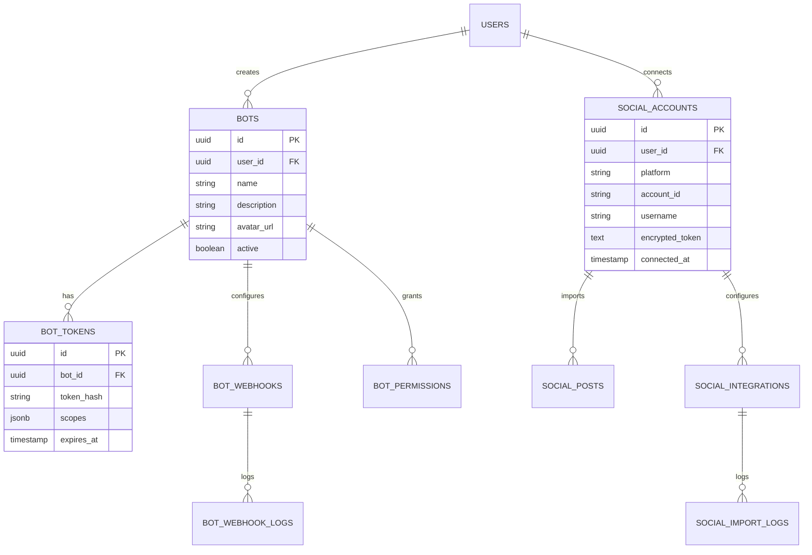
```mermaid
erDiagram
    USERS ||--o{ BOTS : creates
    BOTS ||--o{ BOT_TOKENS : has
    BOTS ||--o{ BOT_WEBHOOKS : configures
    BOTS ||--o{ BOT_PERMISSIONS : grants
    BOT_WEBHOOKS ||--o{ BOT_WEBHOOK_LOGS : logs

    USERS ||--o{ SOCIAL_ACCOUNTS : connects
    SOCIAL_ACCOUNTS ||--o{ SOCIAL_POSTS : imports
    SOCIAL_ACCOUNTS ||--o{ SOCIAL_INTEGRATIONS : configures
    SOCIAL_INTEGRATIONS ||--o{ SOCIAL_IMPORT_LOGS : logs

    BOTS {
        uuid id PK
        uuid user_id FK
        string name
        string description
        string avatar_url
        boolean active
    }

    BOT_TOKENS {
        uuid id PK
        uuid bot_id FK
        string token_hash
        jsonb scopes
        timestamp expires_at
    }

    SOCIAL_ACCOUNTS {
        uuid id PK
        uuid user_id FK
        string platform
        string account_id
        string username
        text encrypted_token
        timestamp connected_at
    }
```

### Polls & Interactive Content

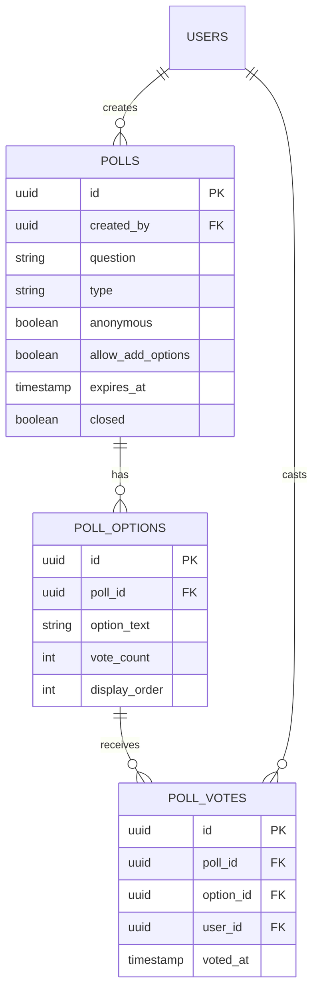
```mermaid
erDiagram
    USERS ||--o{ POLLS : creates
    POLLS ||--o{ POLL_OPTIONS : has
    POLL_OPTIONS ||--o{ POLL_VOTES : receives
    USERS ||--o{ POLL_VOTES : casts

    POLLS {
        uuid id PK
        uuid created_by FK
        string question
        string type
        boolean anonymous
        boolean allow_add_options
        timestamp expires_at
        boolean closed
    }

    POLL_OPTIONS {
        uuid id PK
        uuid poll_id FK
        string option_text
        int vote_count
        int display_order
    }

    POLL_VOTES {
        uuid id PK
        uuid poll_id FK
        uuid option_id FK
        uuid user_id FK
        timestamp voted_at
    }
```

---

## Authentication Flows

### User Login Flow

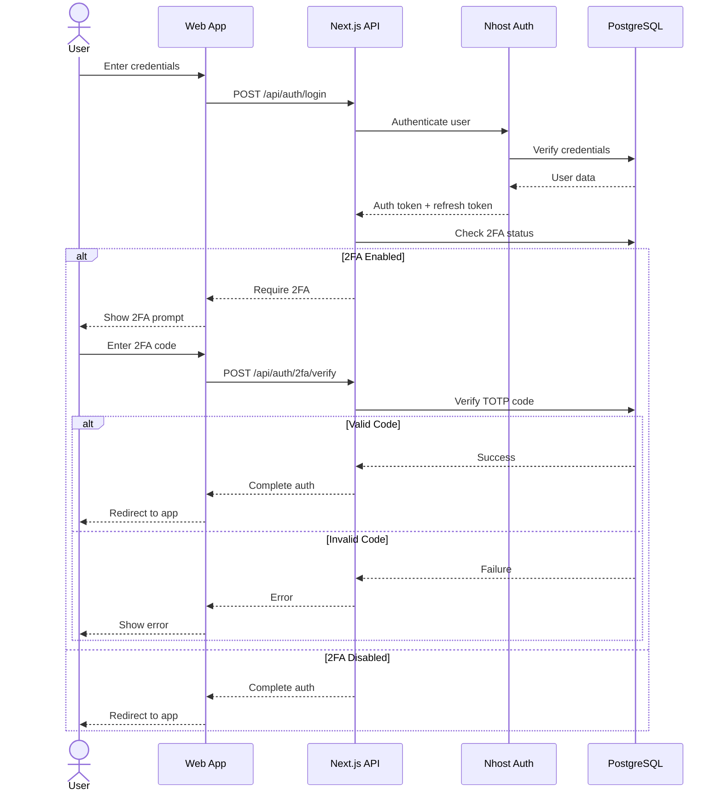
```mermaid
sequenceDiagram
    actor User
    participant Web as Web App
    participant API as Next.js API
    participant Auth as Nhost Auth
    participant DB as PostgreSQL

    User->>Web: Enter credentials
    Web->>API: POST /api/auth/login
    API->>Auth: Authenticate user
    Auth->>DB: Verify credentials
    DB-->>Auth: User data
    Auth-->>API: Auth token + refresh token
    API->>DB: Check 2FA status

    alt 2FA Enabled
        API-->>Web: Require 2FA
        Web-->>User: Show 2FA prompt
        User->>Web: Enter 2FA code
        Web->>API: POST /api/auth/2fa/verify
        API->>DB: Verify TOTP code

        alt Valid Code
            DB-->>API: Success
            API-->>Web: Complete auth
            Web-->>User: Redirect to app
        else Invalid Code
            DB-->>API: Failure
            API-->>Web: Error
            Web-->>User: Show error
        end
    else 2FA Disabled
        API-->>Web: Complete auth
        Web-->>User: Redirect to app
    end
```

### 2FA Setup Flow

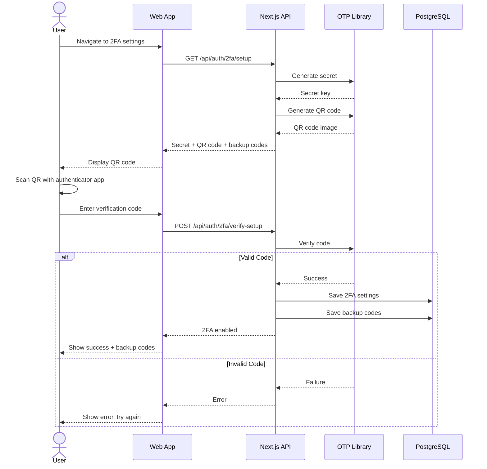
```mermaid
sequenceDiagram
    actor User
    participant Web as Web App
    participant API as Next.js API
    participant OTP as OTP Library
    participant DB as PostgreSQL

    User->>Web: Navigate to 2FA settings
    Web->>API: GET /api/auth/2fa/setup
    API->>OTP: Generate secret
    OTP-->>API: Secret key
    API->>OTP: Generate QR code
    OTP-->>API: QR code image
    API-->>Web: Secret + QR code + backup codes
    Web-->>User: Display QR code

    User->>User: Scan QR with authenticator app
    User->>Web: Enter verification code
    Web->>API: POST /api/auth/2fa/verify-setup
    API->>OTP: Verify code

    alt Valid Code
        OTP-->>API: Success
        API->>DB: Save 2FA settings
        API->>DB: Save backup codes
        API-->>Web: 2FA enabled
        Web-->>User: Show success + backup codes
    else Invalid Code
        OTP-->>API: Failure
        API-->>Web: Error
        Web-->>User: Show error, try again
    end
```

### Social OAuth Flow

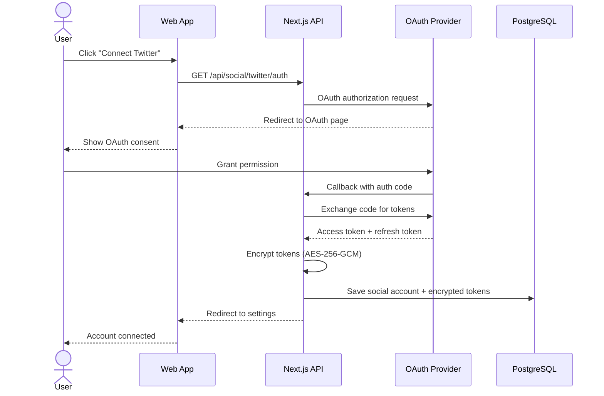
```mermaid
sequenceDiagram
    actor User
    participant Web as Web App
    participant API as Next.js API
    participant Provider as OAuth Provider
    participant DB as PostgreSQL

    User->>Web: Click "Connect Twitter"
    Web->>API: GET /api/social/twitter/auth
    API->>Provider: OAuth authorization request
    Provider-->>Web: Redirect to OAuth page
    Web-->>User: Show OAuth consent

    User->>Provider: Grant permission
    Provider->>API: Callback with auth code
    API->>Provider: Exchange code for tokens
    Provider-->>API: Access token + refresh token
    API->>API: Encrypt tokens (AES-256-GCM)
    API->>DB: Save social account + encrypted tokens
    API-->>Web: Redirect to settings
    Web-->>User: Account connected
```

---

## Message Lifecycle

### Message Send Flow

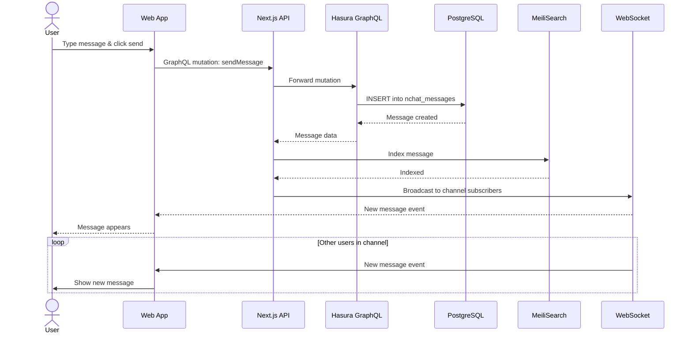
```mermaid
sequenceDiagram
    actor User
    participant Web as Web App
    participant API as Next.js API
    participant Hasura as Hasura GraphQL
    participant DB as PostgreSQL
    participant Search as MeiliSearch
    participant WS as WebSocket

    User->>Web: Type message & click send
    Web->>API: GraphQL mutation: sendMessage
    API->>Hasura: Forward mutation
    Hasura->>DB: INSERT into nchat_messages
    DB-->>Hasura: Message created
    Hasura-->>API: Message data
    API->>Search: Index message
    Search-->>API: Indexed
    API->>WS: Broadcast to channel subscribers
    WS-->>Web: New message event
    Web-->>User: Message appears

    loop Other users in channel
        WS->>Web: New message event
        Web->>User: Show new message
    end
```

### Message Edit Flow

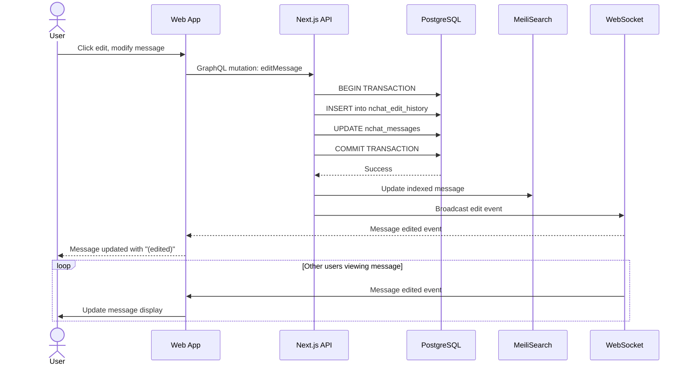
```mermaid
sequenceDiagram
    actor User
    participant Web as Web App
    participant API as Next.js API
    participant DB as PostgreSQL
    participant Search as MeiliSearch
    participant WS as WebSocket

    User->>Web: Click edit, modify message
    Web->>API: GraphQL mutation: editMessage
    API->>DB: BEGIN TRANSACTION
    API->>DB: INSERT into nchat_edit_history
    API->>DB: UPDATE nchat_messages
    API->>DB: COMMIT TRANSACTION
    DB-->>API: Success
    API->>Search: Update indexed message
    API->>WS: Broadcast edit event
    WS-->>Web: Message edited event
    Web-->>User: Message updated with "(edited)"

    loop Other users viewing message
        WS->>Web: Message edited event
        Web->>User: Update message display
    end
```

### Message Delete Flow

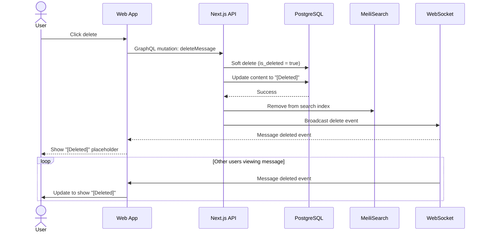
```mermaid
sequenceDiagram
    actor User
    participant Web as Web App
    participant API as Next.js API
    participant DB as PostgreSQL
    participant Search as MeiliSearch
    participant WS as WebSocket

    User->>Web: Click delete
    Web->>API: GraphQL mutation: deleteMessage
    API->>DB: Soft delete (is_deleted = true)
    API->>DB: Update content to "[Deleted]"
    DB-->>API: Success
    API->>Search: Remove from search index
    API->>WS: Broadcast delete event
    WS-->>Web: Message deleted event
    Web-->>User: Show "[Deleted]" placeholder

    loop Other users viewing message
        WS->>Web: Message deleted event
        Web->>User: Update to show "[Deleted]"
    end
```

---

## Search Architecture

### Search Query Flow

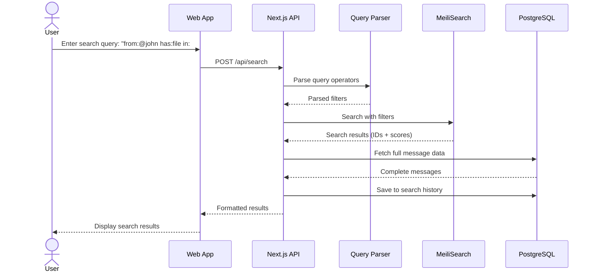
```mermaid
sequenceDiagram
    actor User
    participant Web as Web App
    participant API as Next.js API
    participant Parser as Query Parser
    participant Meili as MeiliSearch
    participant DB as PostgreSQL

    User->>Web: Enter search query: "from:@john has:file in:#general"
    Web->>API: POST /api/search
    API->>Parser: Parse query operators
    Parser-->>API: Parsed filters

    API->>Meili: Search with filters
    Meili-->>API: Search results (IDs + scores)

    API->>DB: Fetch full message data
    DB-->>API: Complete messages

    API->>DB: Save to search history
    API-->>Web: Formatted results
    Web-->>User: Display search results
```

### Search Indexing Flow

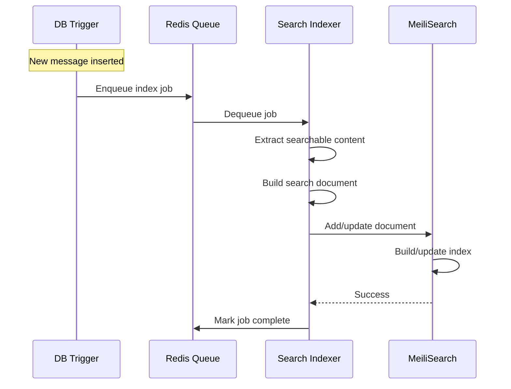
```mermaid
sequenceDiagram
    participant Trigger as DB Trigger
    participant Queue as Redis Queue
    participant Indexer as Search Indexer
    participant Meili as MeiliSearch

    Note over Trigger: New message inserted

    Trigger->>Queue: Enqueue index job
    Queue->>Indexer: Dequeue job

    Indexer->>Indexer: Extract searchable content
    Indexer->>Indexer: Build search document

    Indexer->>Meili: Add/update document
    Meili->>Meili: Build/update index
    Meili-->>Indexer: Success

    Indexer->>Queue: Mark job complete
```

---

## Bot API Flow

### Bot API Request Flow

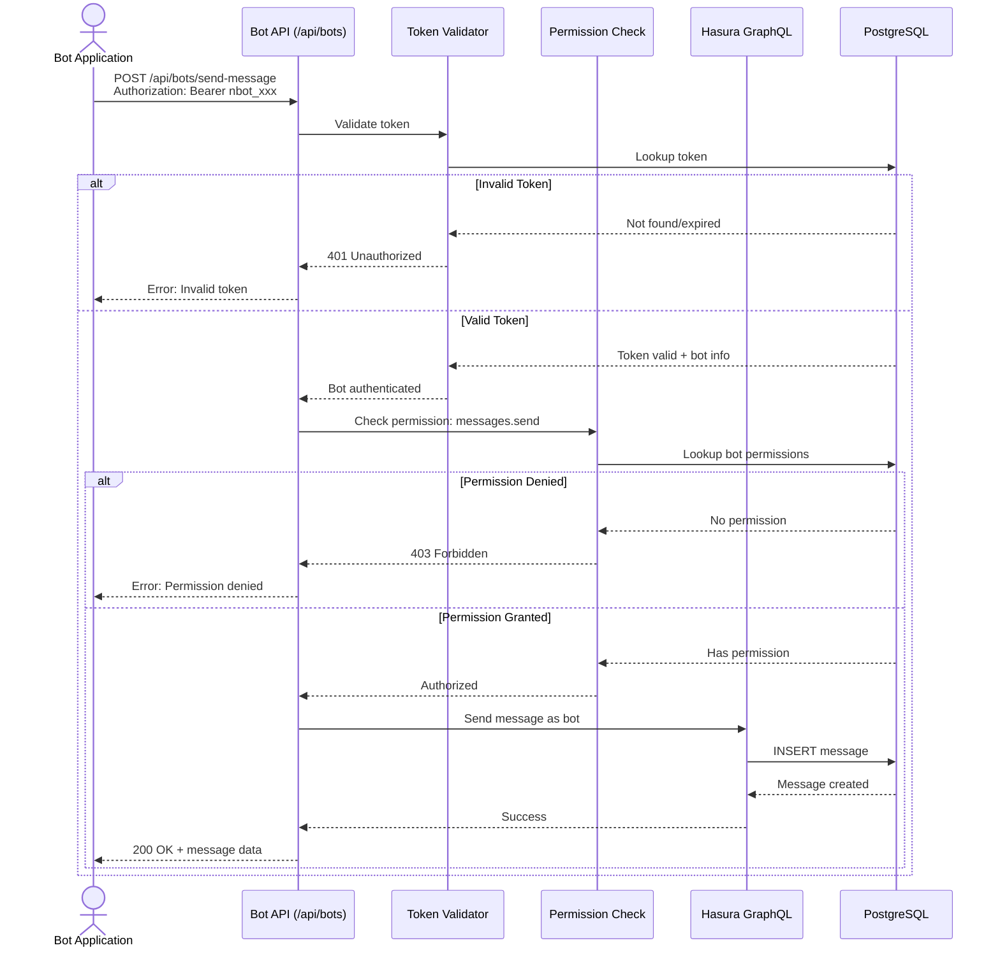
```mermaid
sequenceDiagram
    actor Bot as Bot Application
    participant API as Bot API (/api/bots)
    participant Auth as Token Validator
    participant Perm as Permission Check
    participant Hasura as Hasura GraphQL
    participant DB as PostgreSQL

    Bot->>API: POST /api/bots/send-message<br/>Authorization: Bearer nbot_xxx
    API->>Auth: Validate token
    Auth->>DB: Lookup token

    alt Invalid Token
        DB-->>Auth: Not found/expired
        Auth-->>API: 401 Unauthorized
        API-->>Bot: Error: Invalid token
    else Valid Token
        DB-->>Auth: Token valid + bot info
        Auth-->>API: Bot authenticated

        API->>Perm: Check permission: messages.send
        Perm->>DB: Lookup bot permissions

        alt Permission Denied
            DB-->>Perm: No permission
            Perm-->>API: 403 Forbidden
            API-->>Bot: Error: Permission denied
        else Permission Granted
            DB-->>Perm: Has permission
            Perm-->>API: Authorized

            API->>Hasura: Send message as bot
            Hasura->>DB: INSERT message
            DB-->>Hasura: Message created
            Hasura-->>API: Success
            API-->>Bot: 200 OK + message data
        end
    end
```

### Webhook Delivery Flow

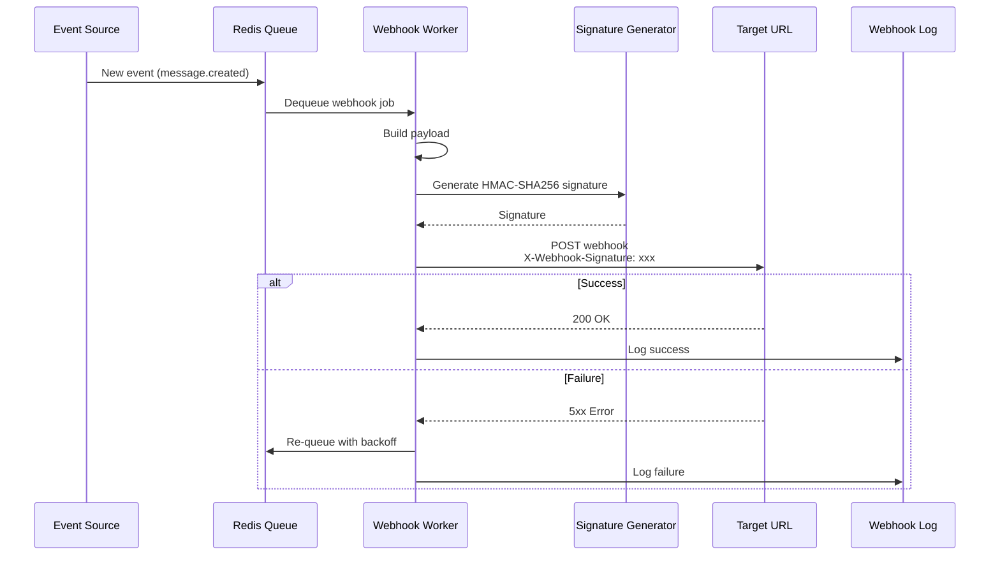
```mermaid
sequenceDiagram
    participant Event as Event Source
    participant Queue as Redis Queue
    participant Worker as Webhook Worker
    participant Sign as Signature Generator
    participant Target as Target URL
    participant Log as Webhook Log

    Event->>Queue: New event (message.created)
    Queue->>Worker: Dequeue webhook job

    Worker->>Worker: Build payload
    Worker->>Sign: Generate HMAC-SHA256 signature
    Sign-->>Worker: Signature

    Worker->>Target: POST webhook<br/>X-Webhook-Signature: xxx

    alt Success
        Target-->>Worker: 200 OK
        Worker->>Log: Log success
    else Failure
        Target-->>Worker: 5xx Error
        Worker->>Queue: Re-queue with backoff
        Worker->>Log: Log failure
    end
```

---

## Social Media Integration

### Social Post Import Flow

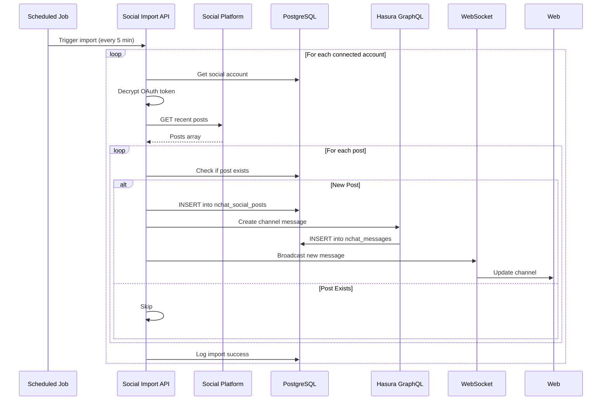
```mermaid
sequenceDiagram
    participant Cron as Scheduled Job
    participant API as Social Import API
    participant Provider as Social Platform
    participant DB as PostgreSQL
    participant Hasura as Hasura GraphQL
    participant WS as WebSocket

    Cron->>API: Trigger import (every 5 min)

    loop For each connected account
        API->>DB: Get social account
        API->>API: Decrypt OAuth token
        API->>Provider: GET recent posts
        Provider-->>API: Posts array

        loop For each post
            API->>DB: Check if post exists

            alt New Post
                API->>DB: INSERT into nchat_social_posts
                API->>Hasura: Create channel message
                Hasura->>DB: INSERT into nchat_messages
                API->>WS: Broadcast new message
                WS->>Web: Update channel
            else Post Exists
                API->>API: Skip
            end
        end

        API->>DB: Log import success
    end
```

---

## Deployment Architecture

### Docker Compose Deployment

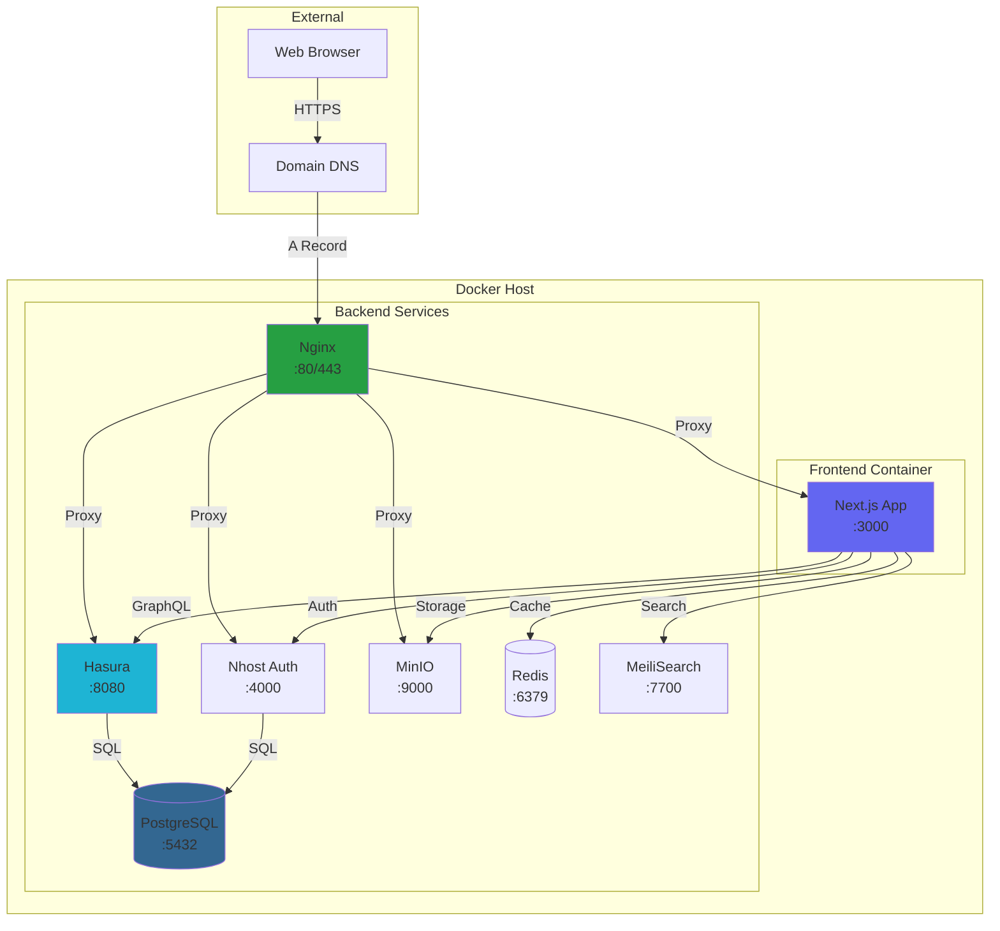
```mermaid
graph TB
    subgraph "Docker Host"
        subgraph "Frontend Container"
            NEXT[Next.js App<br/>:3000]
        end

        subgraph "Backend Services"
            PG[(PostgreSQL<br/>:5432)]
            HASURA[Hasura<br/>:8080]
            AUTH[Nhost Auth<br/>:4000]
            MINIO[MinIO<br/>:9000]
            REDIS[(Redis<br/>:6379)]
            MEILI[MeiliSearch<br/>:7700]
            NGINX[Nginx<br/>:80/443]
        end
    end

    subgraph "External"
        CLIENT[Web Browser]
        DNS[Domain DNS]
    end

    CLIENT -->|HTTPS| DNS
    DNS -->|A Record| NGINX
    NGINX -->|Proxy| NEXT
    NGINX -->|Proxy| HASURA
    NGINX -->|Proxy| AUTH
    NGINX -->|Proxy| MINIO

    NEXT -->|GraphQL| HASURA
    NEXT -->|Auth| AUTH
    NEXT -->|Storage| MINIO
    NEXT -->|Cache| REDIS
    NEXT -->|Search| MEILI

    HASURA -->|SQL| PG
    AUTH -->|SQL| PG

    style NGINX fill:#269f42
    style NEXT fill:#6366f1
    style HASURA fill:#1eb4d4
    style PG fill:#336791
```

### Kubernetes Deployment

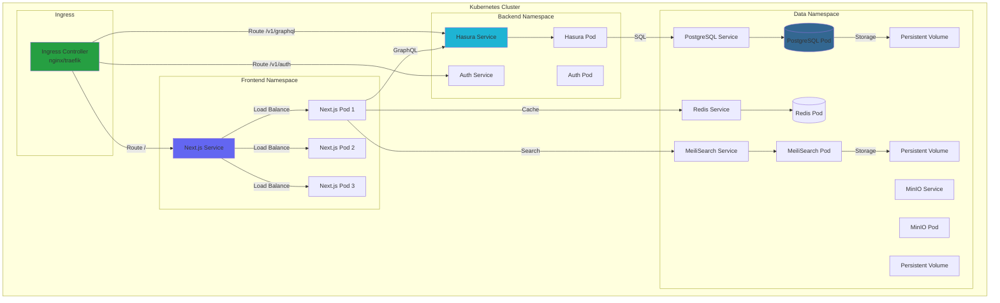
```mermaid
graph TB
    subgraph "Kubernetes Cluster"
        subgraph "Ingress"
            ING[Ingress Controller<br/>nginx/traefik]
        end

        subgraph "Frontend Namespace"
            NEXT_SVC[Next.js Service]
            NEXT_POD1[Next.js Pod 1]
            NEXT_POD2[Next.js Pod 2]
            NEXT_POD3[Next.js Pod 3]
        end

        subgraph "Backend Namespace"
            HASURA_SVC[Hasura Service]
            AUTH_SVC[Auth Service]

            HASURA_POD[Hasura Pod]
            AUTH_POD[Auth Pod]
        end

        subgraph "Data Namespace"
            PG_SVC[PostgreSQL Service]
            PG_POD[(PostgreSQL Pod)]
            PG_PVC[Persistent Volume]

            REDIS_SVC[Redis Service]
            REDIS_POD[(Redis Pod)]

            MEILI_SVC[MeiliSearch Service]
            MEILI_POD[MeiliSearch Pod]
            MEILI_PVC[Persistent Volume]

            MINIO_SVC[MinIO Service]
            MINIO_POD[MinIO Pod]
            MINIO_PVC[Persistent Volume]
        end
    end

    ING -->|Route /| NEXT_SVC
    ING -->|Route /v1/graphql| HASURA_SVC
    ING -->|Route /v1/auth| AUTH_SVC

    NEXT_SVC -->|Load Balance| NEXT_POD1
    NEXT_SVC -->|Load Balance| NEXT_POD2
    NEXT_SVC -->|Load Balance| NEXT_POD3

    NEXT_POD1 -->|GraphQL| HASURA_SVC
    HASURA_SVC --> HASURA_POD

    HASURA_POD -->|SQL| PG_SVC
    PG_SVC --> PG_POD
    PG_POD -->|Storage| PG_PVC

    NEXT_POD1 -->|Cache| REDIS_SVC
    REDIS_SVC --> REDIS_POD

    NEXT_POD1 -->|Search| MEILI_SVC
    MEILI_SVC --> MEILI_POD
    MEILI_POD -->|Storage| MEILI_PVC

    style ING fill:#269f42
    style NEXT_SVC fill:#6366f1
    style HASURA_SVC fill:#1eb4d4
    style PG_POD fill:#336791
```

---

## Frontend State Management

### State Management Architecture

```mermaid
graph TB
    subgraph "React Components"
        APP[App Root]
        CHAT[Chat Interface]
        SETTINGS[Settings]
        ADMIN[Admin Panel]
    end

    subgraph "State Management"
        ZUSTAND[Zustand Stores<br/>Global State]
        APOLLO[Apollo Client<br/>GraphQL Cache]
        CONTEXT[React Context<br/>Theme, Auth, Config]
        LOCALSTORAGE[LocalStorage<br/>Persistence]
    end

    subgraph "Backend"
        API[Next.js API]
        HASURA[Hasura GraphQL]
    end

    APP -->|Use| ZUSTAND
    APP -->|Use| APOLLO
    APP -->|Use| CONTEXT

    CHAT -->|Read/Write| ZUSTAND
    SETTINGS -->|Read/Write| APOLLO
    ADMIN -->|Read/Write| APOLLO

    ZUSTAND <-->|Sync| LOCALSTORAGE
    CONTEXT <-->|Sync| LOCALSTORAGE

    APOLLO -->|Query/Mutation| HASURA
    ZUSTAND -->|Fetch| API

    style ZUSTAND fill:#f59e0b
    style APOLLO fill:#dd00a9
    style CONTEXT fill:#6366f1
```

### Component Communication Flow

```mermaid
sequenceDiagram
    participant User
    participant Component
    participant Store as Zustand Store
    participant Apollo as Apollo Cache
    participant API as GraphQL API
    participant DB as Database

    User->>Component: Trigger action
    Component->>Store: Update local state
    Store-->>Component: State updated
    Component->>Apollo: Execute mutation
    Apollo->>API: GraphQL mutation
    API->>DB: Update database
    DB-->>API: Success
    API-->>Apollo: Response
    Apollo->>Apollo: Update cache
    Apollo-->>Component: Data updated
    Component-->>User: UI reflects changes

    Note over Apollo,Component: Other components subscribed<br/>to Apollo cache auto-update
```

---

## Related Documentation

- [Architecture Reference](reference/Architecture.md)
- [Database Schema](reference/Database-Schema.md)
- [API Documentation](api/API-DOCUMENTATION.md)
- [Deployment Guide](deployment/DEPLOYMENT.md)
- [Project Structure](reference/Project-Structure.md)

---

**Last Updated:** January 30, 2026 • **Version:** 0.3.0
